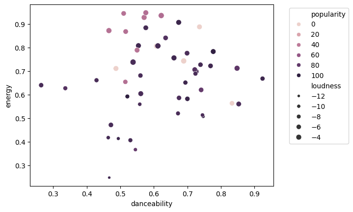
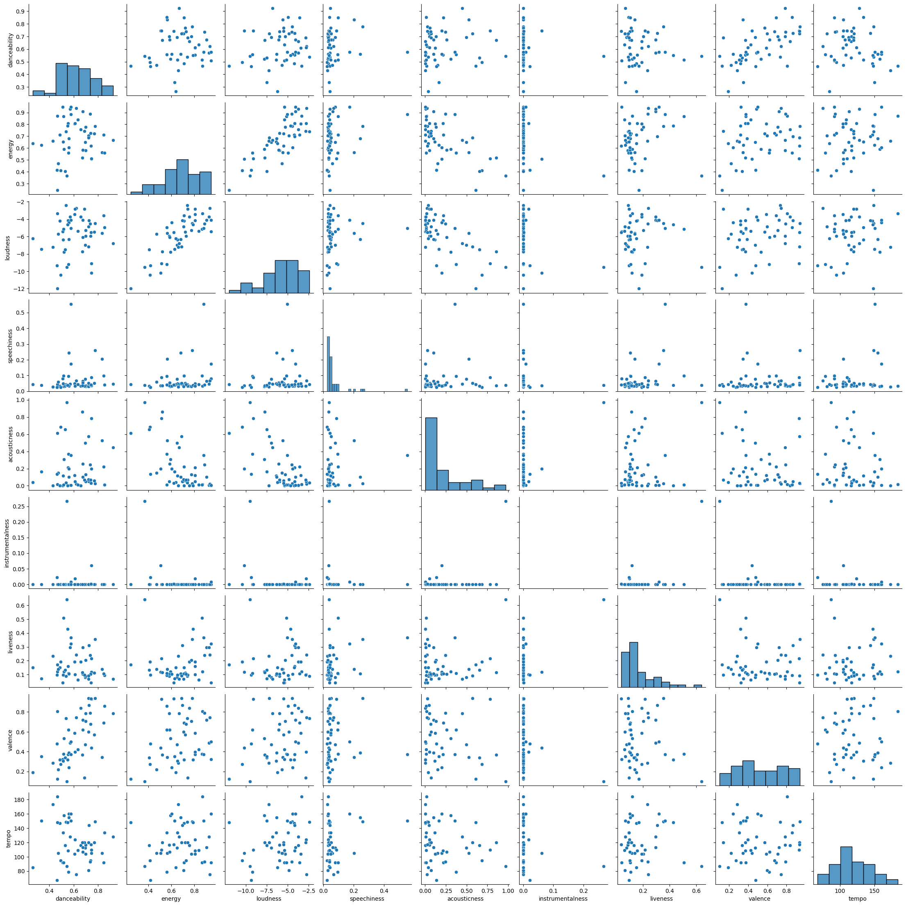

```python

```

# Demo: Using the sung.base Module to Search Tracks and Create a Playlist

In this example, we’ll:
* Search for tracks using Tracks.search with a limit of 7.
* Display the search results in a pandas DataFrame.
* Select three tracks from the search results.
* Create a playlist called "my_test_playlist" with the selected tracks.
* Get the URL of the newly created playlist.
* Instantiate a Playlist object using a URL.
* Delete a playlist


Import the necessary classes from the sung.base module


```python
from sung.base import Tracks, Playlist
```

Search for tracks with the query 'Love', limiting the results to 7
This will return a Tracks object containing the search results


```python
tracks = Tracks.search(query='Love', limit=7)
```

You can also make a `tracks` object by passing a list of track IDs or urls


```python
track_ids = [
    '1vrd6UOGamcKNGnSHJQlSt',
    '3CeCwYWvdfXbZLXFhBrbnf',
    '1dGr1c8CrMLDpV6mPbImSI',
    '0u2P5u6lvoDfwTYjAADbn4',
    'https://open.spotify.com/track/6nGeLlakfzlBcFdZXteDq7',  # url
    'https://open.spotify.com/track/6dBUzqjtbnIa1TwYbyw5CM',   # url
    'spotify:track:7hR22TOX3RorxJPcsz5Wbo',  # uri
]

tracks = Tracks(track_ids)
```

`tracks` is a `Mapping` (that means "dict-like"), so you can do what you do with dicts...

Like listing the tracks' keys (IDs)


```python
list(tracks)
```


    ['1vrd6UOGamcKNGnSHJQlSt',
     '3CeCwYWvdfXbZLXFhBrbnf',
     '1dGr1c8CrMLDpV6mPbImSI',
     '0u2P5u6lvoDfwTYjAADbn4',
     '6nGeLlakfzlBcFdZXteDq7',
     '6dBUzqjtbnIa1TwYbyw5CM',
     '7hR22TOX3RorxJPcsz5Wbo']


```python
tracks.data
```


<div>
<style scoped>
    .dataframe tbody tr th:only-of-type {
        vertical-align: middle;
    }

    .dataframe tbody tr th {
        vertical-align: top;
    }

    .dataframe thead th {
        text-align: right;
    }
</style>
<table border="1" class="dataframe">
  <thead>
    <tr style="text-align: right;">
      <th></th>
      <th>name</th>
      <th>duration_ms</th>
      <th>popularity</th>
      <th>explicit</th>
      <th>id</th>
      <th>album</th>
      <th>artists</th>
      <th>available_markets</th>
      <th>disc_number</th>
      <th>external_ids</th>
      <th>external_urls</th>
      <th>href</th>
      <th>is_local</th>
      <th>preview_url</th>
      <th>track_number</th>
      <th>type</th>
      <th>uri</th>
    </tr>
    <tr>
      <th>id</th>
      <th></th>
      <th></th>
      <th></th>
      <th></th>
      <th></th>
      <th></th>
      <th></th>
      <th></th>
      <th></th>
      <th></th>
      <th></th>
      <th></th>
      <th></th>
      <th></th>
      <th></th>
      <th></th>
      <th></th>
    </tr>
  </thead>
  <tbody>
    <tr>
      <th>1vrd6UOGamcKNGnSHJQlSt</th>
      <td>Love Story</td>
      <td>235266</td>
      <td>62</td>
      <td>False</td>
      <td>1vrd6UOGamcKNGnSHJQlSt</td>
      <td>{'album_type': 'album', 'artists': [{'external...</td>
      <td>[{'external_urls': {'spotify': 'https://open.s...</td>
      <td>[CA, US]</td>
      <td>1</td>
      <td>{'isrc': 'USCJY0803275'}</td>
      <td>{'spotify': 'https://open.spotify.com/track/1v...</td>
      <td>https://api.spotify.com/v1/tracks/1vrd6UOGamcK...</td>
      <td>False</td>
      <td>https://p.scdn.co/mp3-preview/7bc39c6033766fc8...</td>
      <td>3</td>
      <td>track</td>
      <td>spotify:track:1vrd6UOGamcKNGnSHJQlSt</td>
    </tr>
    <tr>
      <th>3CeCwYWvdfXbZLXFhBrbnf</th>
      <td>Love Story (Taylor’s Version)</td>
      <td>235766</td>
      <td>76</td>
      <td>False</td>
      <td>3CeCwYWvdfXbZLXFhBrbnf</td>
      <td>{'album_type': 'single', 'artists': [{'externa...</td>
      <td>[{'external_urls': {'spotify': 'https://open.s...</td>
      <td>[AR, AU, AT, BE, BO, BR, BG, CA, CL, CO, CR, C...</td>
      <td>1</td>
      <td>{'isrc': 'USUG12100342'}</td>
      <td>{'spotify': 'https://open.spotify.com/track/3C...</td>
      <td>https://api.spotify.com/v1/tracks/3CeCwYWvdfXb...</td>
      <td>False</td>
      <td>https://p.scdn.co/mp3-preview/b2c1ed4794591a62...</td>
      <td>1</td>
      <td>track</td>
      <td>spotify:track:3CeCwYWvdfXbZLXFhBrbnf</td>
    </tr>
    <tr>
      <th>1dGr1c8CrMLDpV6mPbImSI</th>
      <td>Lover</td>
      <td>221306</td>
      <td>84</td>
      <td>False</td>
      <td>1dGr1c8CrMLDpV6mPbImSI</td>
      <td>{'album_type': 'album', 'artists': [{'external...</td>
      <td>[{'external_urls': {'spotify': 'https://open.s...</td>
      <td>[AR, AU, AT, BE, BO, BR, BG, CA, CL, CO, CR, C...</td>
      <td>1</td>
      <td>{'isrc': 'USUG11901473'}</td>
      <td>{'spotify': 'https://open.spotify.com/track/1d...</td>
      <td>https://api.spotify.com/v1/tracks/1dGr1c8CrMLD...</td>
      <td>False</td>
      <td>https://p.scdn.co/mp3-preview/aad996e106de5278...</td>
      <td>3</td>
      <td>track</td>
      <td>spotify:track:1dGr1c8CrMLDpV6mPbImSI</td>
    </tr>
    <tr>
      <th>0u2P5u6lvoDfwTYjAADbn4</th>
      <td>lovely (with Khalid)</td>
      <td>200185</td>
      <td>86</td>
      <td>False</td>
      <td>0u2P5u6lvoDfwTYjAADbn4</td>
      <td>{'album_type': 'single', 'artists': [{'externa...</td>
      <td>[{'external_urls': {'spotify': 'https://open.s...</td>
      <td>[AR, AU, AT, BE, BO, BR, BG, CA, CL, CO, CR, C...</td>
      <td>1</td>
      <td>{'isrc': 'USUM71804190'}</td>
      <td>{'spotify': 'https://open.spotify.com/track/0u...</td>
      <td>https://api.spotify.com/v1/tracks/0u2P5u6lvoDf...</td>
      <td>False</td>
      <td>https://p.scdn.co/mp3-preview/18b3cbbad11e488c...</td>
      <td>1</td>
      <td>track</td>
      <td>spotify:track:0u2P5u6lvoDfwTYjAADbn4</td>
    </tr>
    <tr>
      <th>6nGeLlakfzlBcFdZXteDq7</th>
      <td>Love Story</td>
      <td>316280</td>
      <td>74</td>
      <td>False</td>
      <td>6nGeLlakfzlBcFdZXteDq7</td>
      <td>{'album_type': 'album', 'artists': [{'external...</td>
      <td>[{'external_urls': {'spotify': 'https://open.s...</td>
      <td>[AR, AU, AT, BE, BO, BR, BG, CA, CL, CO, CR, C...</td>
      <td>1</td>
      <td>{'isrc': 'FRUM71400048'}</td>
      <td>{'spotify': 'https://open.spotify.com/track/6n...</td>
      <td>https://api.spotify.com/v1/tracks/6nGeLlakfzlB...</td>
      <td>False</td>
      <td>https://p.scdn.co/mp3-preview/677f771b1fc30024...</td>
      <td>3</td>
      <td>track</td>
      <td>spotify:track:6nGeLlakfzlBcFdZXteDq7</td>
    </tr>
    <tr>
      <th>6dBUzqjtbnIa1TwYbyw5CM</th>
      <td>Lovers Rock</td>
      <td>213920</td>
      <td>85</td>
      <td>False</td>
      <td>6dBUzqjtbnIa1TwYbyw5CM</td>
      <td>{'album_type': 'album', 'artists': [{'external...</td>
      <td>[{'external_urls': {'spotify': 'https://open.s...</td>
      <td>[AR, AU, AT, BE, BO, BR, BG, CA, CL, CO, CR, C...</td>
      <td>1</td>
      <td>{'isrc': 'USHM21438143'}</td>
      <td>{'spotify': 'https://open.spotify.com/track/6d...</td>
      <td>https://api.spotify.com/v1/tracks/6dBUzqjtbnIa...</td>
      <td>False</td>
      <td>https://p.scdn.co/mp3-preview/922a42db5aa8f8d3...</td>
      <td>9</td>
      <td>track</td>
      <td>spotify:track:6dBUzqjtbnIa1TwYbyw5CM</td>
    </tr>
    <tr>
      <th>7hR22TOX3RorxJPcsz5Wbo</th>
      <td>Love Somebody</td>
      <td>204828</td>
      <td>86</td>
      <td>False</td>
      <td>7hR22TOX3RorxJPcsz5Wbo</td>
      <td>{'album_type': 'single', 'artists': [{'externa...</td>
      <td>[{'external_urls': {'spotify': 'https://open.s...</td>
      <td>[AR, AU, AT, BE, BO, BR, BG, CA, CL, CO, CR, C...</td>
      <td>1</td>
      <td>{'isrc': 'USUG12406387'}</td>
      <td>{'spotify': 'https://open.spotify.com/track/7h...</td>
      <td>https://api.spotify.com/v1/tracks/7hR22TOX3Ror...</td>
      <td>False</td>
      <td>https://p.scdn.co/mp3-preview/00b94e332ed40625...</td>
      <td>1</td>
      <td>track</td>
      <td>spotify:track:7hR22TOX3RorxJPcsz5Wbo</td>
    </tr>
  </tbody>
</table>
</div>


Like Accessing the value of a track for a given key. 
The value is a bunch of metadata about the track.


```python
track_metadata = tracks['1dGr1c8CrMLDpV6mPbImSI']  # get metadata of track via it's id
assert isinstance(track_metadata, dict)
sorted(track_metadata)
```


    ['album',
     'artists',
     'available_markets',
     'disc_number',
     'duration_ms',
     'explicit',
     'external_ids',
     'external_urls',
     'href',
     'id',
     'is_local',
     'name',
     'popularity',
     'preview_url',
     'track_number',
     'type',
     'uri']


```python
track_metadata = tracks[2]  # get metadata of track via it's id
```


```python
list_of_track_metadatas = tracks[['6dBUzqjtbnIa1TwYbyw5CM', '1vrd6UOGamcKNGnSHJQlSt']]  # get metadata of tracks via a list of ids
```


```python
list_of_track_metadatas = tracks[2:4]  # get metadata of tracks via a slice of ids
```

Display the search results in a pandas DataFrame
The dataframe method converts the track metadata into a DataFrame for easy viewing.

(Note, you can also use the tracks.dataframe(keys, front_columns=...) to retrieve a data table with more control.)


```python
tracks.data

```

    Search Results:


<div>
<style scoped>
    .dataframe tbody tr th:only-of-type {
        vertical-align: middle;
    }

    .dataframe tbody tr th {
        vertical-align: top;
    }

    .dataframe thead th {
        text-align: right;
    }
</style>
<table border="1" class="dataframe">
  <thead>
    <tr style="text-align: right;">
      <th></th>
      <th>name</th>
      <th>duration_ms</th>
      <th>popularity</th>
      <th>explicit</th>
      <th>id</th>
      <th>album</th>
      <th>artists</th>
      <th>available_markets</th>
      <th>disc_number</th>
      <th>external_ids</th>
      <th>external_urls</th>
      <th>href</th>
      <th>is_local</th>
      <th>preview_url</th>
      <th>track_number</th>
      <th>type</th>
      <th>uri</th>
    </tr>
    <tr>
      <th>id</th>
      <th></th>
      <th></th>
      <th></th>
      <th></th>
      <th></th>
      <th></th>
      <th></th>
      <th></th>
      <th></th>
      <th></th>
      <th></th>
      <th></th>
      <th></th>
      <th></th>
      <th></th>
      <th></th>
      <th></th>
    </tr>
  </thead>
  <tbody>
    <tr>
      <th>1vrd6UOGamcKNGnSHJQlSt</th>
      <td>Love Story</td>
      <td>235266</td>
      <td>62</td>
      <td>False</td>
      <td>1vrd6UOGamcKNGnSHJQlSt</td>
      <td>{'album_type': 'album', 'artists': [{'external...</td>
      <td>[{'external_urls': {'spotify': 'https://open.s...</td>
      <td>[CA, US]</td>
      <td>1</td>
      <td>{'isrc': 'USCJY0803275'}</td>
      <td>{'spotify': 'https://open.spotify.com/track/1v...</td>
      <td>https://api.spotify.com/v1/tracks/1vrd6UOGamcK...</td>
      <td>False</td>
      <td>None</td>
      <td>3</td>
      <td>track</td>
      <td>spotify:track:1vrd6UOGamcKNGnSHJQlSt</td>
    </tr>
    <tr>
      <th>3CeCwYWvdfXbZLXFhBrbnf</th>
      <td>Love Story (Taylor’s Version)</td>
      <td>235766</td>
      <td>76</td>
      <td>False</td>
      <td>3CeCwYWvdfXbZLXFhBrbnf</td>
      <td>{'album_type': 'single', 'artists': [{'externa...</td>
      <td>[{'external_urls': {'spotify': 'https://open.s...</td>
      <td>[AR, AU, AT, BE, BO, BR, BG, CA, CL, CO, CR, C...</td>
      <td>1</td>
      <td>{'isrc': 'USUG12100342'}</td>
      <td>{'spotify': 'https://open.spotify.com/track/3C...</td>
      <td>https://api.spotify.com/v1/tracks/3CeCwYWvdfXb...</td>
      <td>False</td>
      <td>None</td>
      <td>1</td>
      <td>track</td>
      <td>spotify:track:3CeCwYWvdfXbZLXFhBrbnf</td>
    </tr>
    <tr>
      <th>1dGr1c8CrMLDpV6mPbImSI</th>
      <td>Lover</td>
      <td>221306</td>
      <td>84</td>
      <td>False</td>
      <td>1dGr1c8CrMLDpV6mPbImSI</td>
      <td>{'album_type': 'album', 'artists': [{'external...</td>
      <td>[{'external_urls': {'spotify': 'https://open.s...</td>
      <td>[AR, AU, AT, BE, BO, BR, BG, CA, CL, CO, CR, C...</td>
      <td>1</td>
      <td>{'isrc': 'USUG11901473'}</td>
      <td>{'spotify': 'https://open.spotify.com/track/1d...</td>
      <td>https://api.spotify.com/v1/tracks/1dGr1c8CrMLD...</td>
      <td>False</td>
      <td>None</td>
      <td>3</td>
      <td>track</td>
      <td>spotify:track:1dGr1c8CrMLDpV6mPbImSI</td>
    </tr>
    <tr>
      <th>0u2P5u6lvoDfwTYjAADbn4</th>
      <td>lovely (with Khalid)</td>
      <td>200185</td>
      <td>86</td>
      <td>False</td>
      <td>0u2P5u6lvoDfwTYjAADbn4</td>
      <td>{'album_type': 'single', 'artists': [{'externa...</td>
      <td>[{'external_urls': {'spotify': 'https://open.s...</td>
      <td>[AR, AU, AT, BE, BO, BR, BG, CA, CL, CO, CR, C...</td>
      <td>1</td>
      <td>{'isrc': 'USUM71804190'}</td>
      <td>{'spotify': 'https://open.spotify.com/track/0u...</td>
      <td>https://api.spotify.com/v1/tracks/0u2P5u6lvoDf...</td>
      <td>False</td>
      <td>None</td>
      <td>1</td>
      <td>track</td>
      <td>spotify:track:0u2P5u6lvoDfwTYjAADbn4</td>
    </tr>
    <tr>
      <th>6nGeLlakfzlBcFdZXteDq7</th>
      <td>Love Story</td>
      <td>316280</td>
      <td>74</td>
      <td>False</td>
      <td>6nGeLlakfzlBcFdZXteDq7</td>
      <td>{'album_type': 'album', 'artists': [{'external...</td>
      <td>[{'external_urls': {'spotify': 'https://open.s...</td>
      <td>[AR, AU, AT, BE, BO, BR, BG, CA, CL, CO, CR, C...</td>
      <td>1</td>
      <td>{'isrc': 'FRUM71400048'}</td>
      <td>{'spotify': 'https://open.spotify.com/track/6n...</td>
      <td>https://api.spotify.com/v1/tracks/6nGeLlakfzlB...</td>
      <td>False</td>
      <td>None</td>
      <td>3</td>
      <td>track</td>
      <td>spotify:track:6nGeLlakfzlBcFdZXteDq7</td>
    </tr>
    <tr>
      <th>6dBUzqjtbnIa1TwYbyw5CM</th>
      <td>Lovers Rock</td>
      <td>213920</td>
      <td>85</td>
      <td>False</td>
      <td>6dBUzqjtbnIa1TwYbyw5CM</td>
      <td>{'album_type': 'album', 'artists': [{'external...</td>
      <td>[{'external_urls': {'spotify': 'https://open.s...</td>
      <td>[AR, AU, AT, BE, BO, BR, BG, CA, CL, CO, CR, C...</td>
      <td>1</td>
      <td>{'isrc': 'USHM21438143'}</td>
      <td>{'spotify': 'https://open.spotify.com/track/6d...</td>
      <td>https://api.spotify.com/v1/tracks/6dBUzqjtbnIa...</td>
      <td>False</td>
      <td>https://p.scdn.co/mp3-preview/922a42db5aa8f8d3...</td>
      <td>9</td>
      <td>track</td>
      <td>spotify:track:6dBUzqjtbnIa1TwYbyw5CM</td>
    </tr>
    <tr>
      <th>7hR22TOX3RorxJPcsz5Wbo</th>
      <td>Love Somebody</td>
      <td>204828</td>
      <td>86</td>
      <td>False</td>
      <td>7hR22TOX3RorxJPcsz5Wbo</td>
      <td>{'album_type': 'single', 'artists': [{'externa...</td>
      <td>[{'external_urls': {'spotify': 'https://open.s...</td>
      <td>[AR, AU, AT, BE, BO, BR, BG, CA, CL, CO, CR, C...</td>
      <td>1</td>
      <td>{'isrc': 'USUG12406387'}</td>
      <td>{'spotify': 'https://open.spotify.com/track/7h...</td>
      <td>https://api.spotify.com/v1/tracks/7hR22TOX3Ror...</td>
      <td>False</td>
      <td>None</td>
      <td>1</td>
      <td>track</td>
      <td>spotify:track:7hR22TOX3RorxJPcsz5Wbo</td>
    </tr>
  </tbody>
</table>
</div>


Select three tracks from the search results
Here, we select the first three track IDs from the search results


```python
selected_track_ids = tracks.track_ids[:3]
print("\nSelected Track IDs:")
print(selected_track_ids)
```

    
    Selected Track IDs:
    ['6FjErEvVbuC32xi4QJUXM0', '1vrd6UOGamcKNGnSHJQlSt', '3CeCwYWvdfXbZLXFhBrbnf']


Create a new playlist named 'my_test_playlist' with the selected tracks
The create_from_track_list class method creates a new playlist with the given tracks


```python
playlist = Playlist.create_from_track_list(
    track_list=selected_track_ids,
    playlist_name='my_test_playlist'
)
print(f"\nPlaylist '{playlist.playlist_id}' created successfully.")

```

    
    Playlist '7BZcFvIWUnVzvZ5wpVt9cD' created successfully.


Get the playlist URL of the newly created playlist (go check it out!)


```python
playlist.playlist_url
```


    'https://open.spotify.com/playlist/7BZcFvIWUnVzvZ5wpVt9cD'


Delete a playlist

We purposely tried to make deleting a playlist not as easy as the other actions. 
So we didn't attach a delete method to the playlist instance, but put this in a 
separate function you have to import. 
Also, we made that function verbose, and asking for confirmation by default. 
(But there's arguments to control that, so you can use `functools.partial` to 
make your own cowboy (not speaking and not asking for permission) version).


```python
from sung import delete_playlist

delete_playlist(playlist.playlist_id)
```

Instantiate a Playlist object using a URL.
This allows you to interact with the playlist, such as accessing its tracks.


```python
top50_global_url = 'https://open.spotify.com/playlist/37i9dQZEVXbMDoHDwVN2tF?si=d6e0c7bc8f59473b'
top50_playlist = Playlist(top50_global_url)
df = top50_playlist.data
df['first_artist'] = df['artists'].apply(lambda x: x[0]['name'])
df['name_and_first_artist'] = df['name'] + ' - ' + df['first_artist']
top_5_tracks = top50_playlist.data.iloc[:5].name_and_first_artist
top_5_tracks
```


    id
    2plbrEY59IikOBgBGLjaoe          Die With A Smile - Lady Gaga
    5vNRhkKd0yEAg8suGBpjeY                           APT. - ROSÉ
    6dOtVTDdiauQNBQEDOtlAB    BIRDS OF A FEATHER - Billie Eilish
    7ne4VBA60CxGM75vw0EYad        That’s So True - Gracie Abrams
    7tI8dRuH2Yc6RuoTjxo4dU                           Who - Jimin
    Name: name_and_first_artist, dtype: object


## Audio features


```python
import pandas as pd

print(f"{top50_playlist.audio_features_df.shape=}")
top50_playlist.audio_features_df.iloc[0]

```

    top50_playlist.audio_features_df.shape=(50, 17)


    danceability                                                    0.521
    energy                                                          0.592
    key                                                                 6
    loudness                                                       -7.777
    mode                                                                0
    speechiness                                                    0.0304
    acousticness                                                    0.308
    instrumentalness                                                  0.0
    liveness                                                        0.122
    valence                                                         0.535
    tempo                                                         157.969
    type                                                   audio_features
    uri                              spotify:track:2plbrEY59IikOBgBGLjaoe
    track_href          https://api.spotify.com/v1/tracks/2plbrEY59Iik...
    analysis_url        https://api.spotify.com/v1/audio-analysis/2plb...
    duration_ms                                                    251668
    time_signature                                                      3
    Name: 2plbrEY59IikOBgBGLjaoe, dtype: object


```python
import seaborn as sns
from matplotlib import pyplot as plt

df = pd.merge(top50_playlist.data, top50_playlist.audio_features_df, left_index=True, right_index=True)
# scatter plot with danceability and energy, colored by popularity, with size as loudness
sns.scatterplot(data=df, x='danceability', y='energy', hue='popularity', size='loudness')

# Move the legend outside the plot
plt.legend(bbox_to_anchor=(1.05, 1), loc='upper left');
```


    

    


```python
import seaborn as sns

sns.pairplot(top50_playlist.audio_features_df[['danceability', 'energy', 'loudness', 'speechiness', 'acousticness', 'instrumentalness', 'liveness', 'valence', 'tempo']])
```


    <seaborn.axisgrid.PairGrid at 0x10ac069b0>


    

    


## Audio analysis


```python
audio_analysis = top50_playlist.audio_analysis(next(iter(top50_playlist)))
```


```python
type(audio_analysis)
```


    dict


```python
list(audio_analysis)
```


    ['meta', 'track', 'bars', 'beats', 'sections', 'segments', 'tatums']


```python
audio_analysis['meta']
```


    {'analyzer_version': '4.0.0',
     'platform': 'Linux',
     'detailed_status': 'OK',
     'status_code': 0,
     'timestamp': 1723785476,
     'analysis_time': 5.78793,
     'input_process': 'libvorbisfile L+R 44100->22050'}


```python
audio_analysis['track']
```


    {'num_samples': 5549270,
     'duration': 251.66757,
     'sample_md5': '',
     'offset_seconds': 0,
     'window_seconds': 0,
     'analysis_sample_rate': 22050,
     'analysis_channels': 1,
     'end_of_fade_in': 0.2034,
     'start_of_fade_out': 241.98096,
     'loudness': -7.863,
     'tempo': 158.005,
     'tempo_confidence': 0.501,
     'time_signature': 3,
     'time_signature_confidence': 1.0,
     'key': 6,
     'key_confidence': 0.253,
     'mode': 0,
     'mode_confidence': 0.452,
     'codestring': 'eJxVmgcC...twbhuw==',
     'code_version': 3.15,
     'echoprintstring': '...',
     'echoprint_version': 4.12,
     'synchstring': 'eJxVWYmR6zoMa8UlSDx09N...EsF7ZvNGhvn5DzGSYaU=',
     'synch_version': 1.0,
     'rhythmstring': 'eJxdnAmSWzkSQ6..._8hOM4=',
     'rhythm_version': 1.0}


```python
from lkj import truncate_dict_values

print(f"{len(audio_analysis['bars'])=})")
truncate_dict_values(audio_analysis['bars'])
```

    len(audio_analysis['bars'])=211)


    [{'start': 1.36936, 'duration': 1.1373, 'confidence': 0.506},
     {'start': 2.50666, 'duration': 1.14286, 'confidence': 0.037}]


```python
print(f"{len(audio_analysis['beats'])=})")
truncate_dict_values(audio_analysis['beats'])
```

    len(audio_analysis['beats'])=639)


    [{'start': 0.598, 'duration': 0.39454, 'confidence': 0.786},
     {'start': 0.99254, 'duration': 0.37682, 'confidence': 0.461}]


```python
print(f"{len(audio_analysis['sections'])=})")
truncate_dict_values(audio_analysis['sections'])
```

    len(audio_analysis['sections'])=10)


    [{'start': 0.0,
      'duration': 9.72348,
      'confidence': 1.0,
      'loudness': -22.269,
      'tempo': 158.348,
      'tempo_confidence': 0.353,
      'key': 1,
      'key_confidence': 0.03,
      'mode': 0,
      'mode_confidence': 0.567,
      'time_signature': 3,
      'time_signature_confidence': 1.0},
     {'start': 9.72348,
      'duration': 29.24311,
      'confidence': 0.606,
      'loudness': -11.712,
      'tempo': 158.114,
      'tempo_confidence': 0.364,
      'key': 9,
      'key_confidence': 0.217,
      'mode': 1,
      'mode_confidence': 0.472,
      'time_signature': 3,
      'time_signature_confidence': 1.0}]


```python
print(f"{len(audio_analysis['segments'])=})")
truncate_dict_values(audio_analysis['segments'])
```

    len(audio_analysis['segments'])=780)


    [{'start': 0.0,
      'duration': 0.2034,
      'confidence': 0.0,
      'loudness_start': -60.0,
      'loudness_max_time': 0.0,
      'loudness_max': -60.0,
      'loudness_end': 0.0,
      'pitches': [1.0, 1.0],
      'timbre': [0.0, 171.13]},
     {'start': 0.2034,
      'duration': 0.41234,
      'confidence': 1.0,
      'loudness_start': -60.0,
      'loudness_max_time': 0.05445,
      'loudness_max': -22.196,
      'loudness_end': 0.0,
      'pitches': [0.082, 0.554],
      'timbre': [33.758, 53.096]}]


```python
print(f"{len(audio_analysis['tatums'])=})")
truncate_dict_values(audio_analysis['tatums'])
```

    len(audio_analysis['tatums'])=1278)


    [{'start': 0.598, 'duration': 0.19727, 'confidence': 0.786},
     {'start': 0.79527, 'duration': 0.19727, 'confidence': 0.786}]


```python
from lkj import truncate_dict_values

truncate_dict_values(audio_analysis, max_list_size=2)
```


    {'meta': {'analyzer_version': '4.0.0',
      'platform': 'Linux',
      'detailed_status': 'OK',
      'status_code': 0,
      'timestamp': 1476616359,
      'analysis_time': 109.6869,
      'input_process': 'libvorbisfile L+R 44100->22050'},
     'track': {'num_samples': 15594936,
      'duration': 707.25336,
      'sample_md5': '',
      'offset_seconds': 0,
      'window_seconds': 0,
      'analysis_sample_rate': 22050,
      'analysis_channels': 1,
      'end_of_fade_in': 2.82703,
      'start_of_fade_out': 693.6381,
      'loudness': -10.355,
      'tempo': 106.396,
      'tempo_confidence': 0.595,
      'time_signature': 4,
      'time_signature_confidence': 0.904,
      'key': 5,
      'key_confidence': 0.049,
      'mode': 0,
      'mode_confidence': 0.228,
      'codestring': 'eJw1nQmS5LqOBK9SRxB38v4X63BHtv2...y2bmBs1qBYvtiECKLDlx_oH4Y3DGg==',
      'code_version': 3.15,
      'echoprintstring': 'eJzcnQ2u7DhzZLckUaRILkf82_8S5oT...av23MzLxruBTa5AgsAdSL_-A1nrtTE=',
      'echoprint_version': 4.12,
      'synchstring': 'eJx9mAuS5DgIRK_iI1h_6_4XW_IlclV...OPN79PfjNMgH2A-QVgPFZR_AHMBU_o=',
      'synch_version': 1.0,
      'rhythmstring': 'eJyNnVmSJEmOQ68SR9B9uf_FxogHqme...EXgaMRt5h7-gy4yclWmWjb8_wC55QRT',
      'rhythm_version': 1.0},
     'bars': [{'start': 2.64511, 'duration': 2.23768, 'confidence': 0.825},
      {'start': 4.88279, 'duration': 2.16451, 'confidence': 0.352}],
     'beats': [{'start': 0.9181, 'duration': 0.58698, 'confidence': 0.683},
      {'start': 1.50508, 'duration': 0.57369, 'confidence': 0.572}],
     'sections': [{'start': 0.0,
       'duration': 11.51788,
       'confidence': 1.0,
       'loudness': -20.409,
       'tempo': 108.121,
       'tempo_confidence': 0.728,
       'key': 6,
       'key_confidence': 0.162,
       'mode': 1,
       'mode_confidence': 0.478,
       'time_signature': 4,
       'time_signature_confidence': 0.1},
      {'start': 11.51788,
       'duration': 30.61314,
       'confidence': 0.731,
       'loudness': -12.171,
       'tempo': 107.882,
       'tempo_confidence': 0.499,
       'key': 10,
       'key_confidence': 0.429,
       'mode': 0,
       'mode_confidence': 0.387,
       'time_signature': 4,
       'time_signature_confidence': 0.467}],
     'segments': [{'start': 0.0,
       'duration': 0.60957,
       'confidence': 0.0,
       'loudness_start': -60.0,
       'loudness_max_time': 0.5863,
       'loudness_max': -56.103,
       'loudness_end': 0.0,
       'pitches': [0.8, 0.511],
       'timbre': [0.116, 169.016]},
      {'start': 0.60957,
       'duration': 0.60376,
       'confidence': 1.0,
       'loudness_start': -55.895,
       'loudness_max_time': 0.03504,
       'loudness_max': -36.652,
       'loudness_end': 0.0,
       'pitches': [0.434, 0.38],
       'timbre': [13.111, 157.189]}],
     'tatums': [{'start': 0.9181, 'duration': 0.29349, 'confidence': 0.683},
      {'start': 1.21159, 'duration': 0.29349, 'confidence': 0.683}]}


